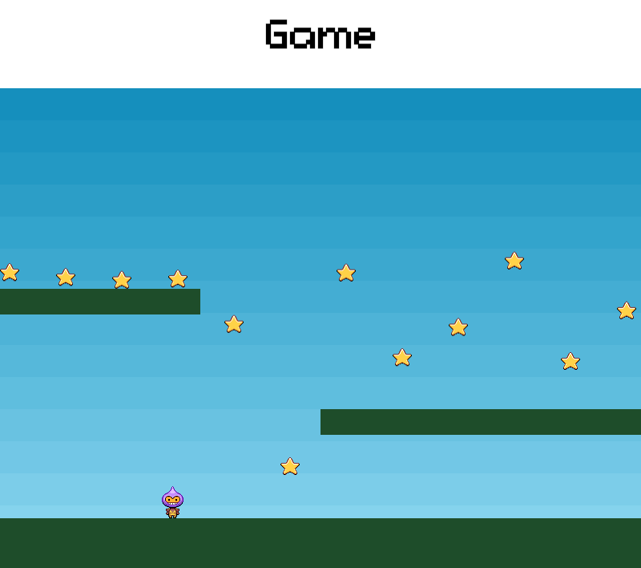

## Boilerplate for Phaser-CE in Typescript

[Phaser](https://github.com/photonstorm/phaser) is a fast, free, and fun open source HTML5 game framework

### What is this

The game is created by following the official Phaser [tutorial](https://phaser.io/tutorials/making-your-first-phaser-2-game)

I had some hard times, though, combining Phaser with TypeScript, making it modular, readable, and moreover maintaining all type definitions

I ended up with is my own revisitation of Phaser “components", basically moving away from JS classes, and making instead a nicer use of closures

#### Before

```
export class PlayerClass {
  player: Player
  constructor(private state: Phaser.State) {}

  create(): Phaser.Sprite {
    this.player = this.state.add.sprite(
      32,
      this.state.world.height - 150,
      'dude'
    ) as Player
    this.state.physics.arcade.enable(this.player)

    this.player.body.bounce.y = 0.2
    this.player.body.gravity.y = 300
    this.player.body.collideWorldBounds = true

    this.player.animations.add('left', [0, 1, 2, 3], 10, true)
    this.player.animations.add('right', [5, 6, 7, 8], 10, true)

    return this.player
  }

  setSpeedX(speed: number): Player {
    this.player.body.velocity.x = speed
    return this.player
  }

  turnLeft(): Player {
    this.setSpeedX(-150)
    this.player.animations.play('left')
    return this.player
  }

  turnRight(): Player {
    this.setSpeedX(150)
    this.player.animations.play('right')
    return this.player
  }
}
```

#### After

```
import * as _ from 'lodash-es'

export function PlayerFactory(
  state: Phaser.State
): Player {
  const player = state.add.sprite(
    32,
    state.world.height - 150,
    'dude'
  ) as Player

  state.physics.arcade.enable(player)
  player.body.bounce.y = 0.2
  player.body.gravity.y = 300
  player.body.collideWorldBounds = true

  player.animations.add('left', [0, 1, 2, 3], 10, true)
  player.animations.add('right', [5, 6, 7, 8], 10, true)

  return _.merge(player, {
    setSpeedX(speed: number): Player {
      player.body.velocity.x = speed
      return player
    },

    turnLeft(): Player {
      player.animations.play('left')
      return player.setSpeedX(-150)
    },

    turnRight(): Player {
      player.animations.play('right')
      return player.setSpeedX(150)
    },
  })
}
```

### Clone, Install, Run

```
git clone git@github.com:L-oris/phaser-CE_boilerplate.git
cd phaser-CE_boilerplate
yarn && yarn dev
```

The browser will automatically open on port 8080


